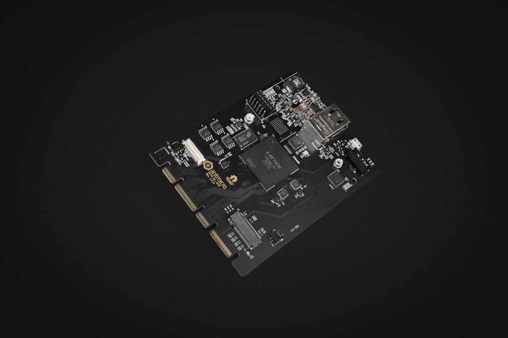

============
ECP5 DC-SCM
============

Copyright (c) 2020-2021 `Antmicro <https://www.antmicro.com>`_

Overview
--------

This repository contains design files of the experimental Data Center Secure Control Module (DC-SCM).
The main purpose of this platform is to provide open-source DC-SCM with Baseboard Management Controller (BMC) unit based on Lattice ECP5 FPGA family.
The design files were prepared in KiCad.
This design is now a Work in Progress.

Repository structure
--------------------
The main repository directory contains KiCad PCB project files, a LICENSE and README.
The remaining files are stored in the following directories:

* ``lib`` - contains the component libraries
* ``img`` - contains graphics for this README

Key Features
------------

* ECP5 FPGA - LFE5UM5G-85F-8BG756C
* DC-SCI standard 168-pin 4C+ edge connector
* On-board DDR3 DRAM and eMMC
* QSPI FLASH memory
* Gigabit Ethernet interface with KSZ9031RNXCA transciever
* JTAG connector
* M.2 (key M) connector with PCIe x4 interface
* 13 I2C buses, 4 I3C buses
* dual UART 
* 2x USB 2.0 host/device PHY (USB3300)
* SPI connector
* RoT module connector
* TPM SPI connector
* optional external 12V power input 

Block diagram
-------------

License
=======

`Apache-2.0 <LICENSE>`_
